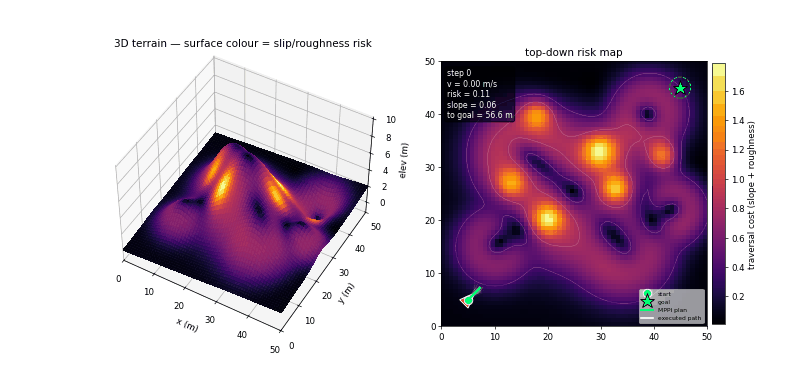
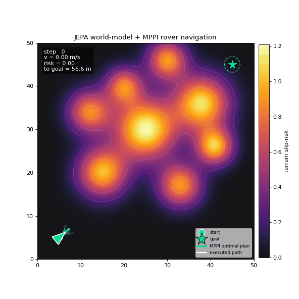

# 🤖 JEPA-Rover — world-model navigation with MPPI

<p align="center">
  <br>
  <em>Real physics (PyBullet): a Husky crosses heightfield terrain under full contact dynamics.
  Left = chase-cam; right = top-down slope-risk map with the executed path (white) and the live
  MPPI fan (cyan) the JEPA world-model hallucinates. It <strong>arcs around the steep central
  massif</strong> instead of climbing it — 0 rollovers.</em>
</p>
<p align="center">
  <br>
  <em>3D (analytic): rover crossing elevation terrain — surface colour = slip/roughness risk, cyan = the MPPI plan
  the JEPA world-model imagines, faint blue = the sampled "hallucinated" trajectories.</em>
</p>
<p align="center">
  <br>
  <em>2D: the same idea on a continuous Gaussian-hazard cost map.</em>
</p>

**2D:** [](https://colab.research.google.com/github/Maverick-Ansh/jepa-rover/blob/master/notebooks/jepa_rover_2d.ipynb) &nbsp; **3D:** [](https://colab.research.google.com/github/Maverick-Ansh/jepa-rover/blob/master/notebooks/jepa_rover_3d.ipynb) &nbsp; **PyBullet:** [](https://colab.research.google.com/github/Maverick-Ansh/jepa-rover/blob/master/notebooks/jepa_rover_pybullet.ipynb)

A rover crosses a hazardous, continuous terrain by **imagining the future in a
learned latent space** (a PyTorch **JEPA** — Joint Embedding Predictive
Architecture) and planning smooth controls with **MPPI** (Model Predictive Path
Integral). Everything is built from scratch and heavily instrumented so you can
inspect every internal: the sensed terrain patch, the raw latent vector, the
predictor's prediction error, the evaluator's risk calibration, and the MPPI
candidate costs/weights.

## The core idea: two spaces

| | **Raw state space** (`x`) | **JEPA latent space** (`s`) |
|---|---|---|
| What | pose `[x,y,θ]` + the *unknown* terrain risk field | a compact `ℝ³²` vector |
| Dynamics | true physics / sensors | a neural net `s_{t+1} ≈ P(s_t, a_t)` |
| Used for | the real executed step + rendering | **planning / imagination** |

JEPA never reconstructs the terrain. It only learns to **predict the next latent
embedding** of the world given an action, with the prediction error measured in
`s`-space — so the model keeps only what matters for the task (risk) and throws
away the rest.

## Architecture

1. **ContextEncoder** `f_θ: o_t → s_t` — compresses the 50-D local observation
   (a 7×7 egocentric risk patch + speed) into a 32-D latent.
2. **Predictor** `P: (s_t, a_t) → ŝ_{t+1}` — *residual* world-model that advances
   the latent **without touching the environment**. MPPI rolls this 8 steps ×
   100 trajectories in a single batched tensor.
3. **TaskEvaluator** `h: s_t → risk ≥ 0` — reads a scalar danger score from a latent.

Trained self-supervised with the JEPA energy
`‖P(f_θ(o_t),a_t) − sg[f_ξ(o_{t+1})]‖²` against an **EMA target encoder** `f_ξ`,
plus a **VICReg variance term** (anti-collapse) and risk grounding.

The rover's **own kinematics are analytic** (it knows how its wheels move it);
JEPA is used only for the genuinely unknown part — *how risky is the terrain I'm
driving into, several steps ahead?*

## Results (2D, `rover_2d.py`)

- Reaches the goal (final distance < 1.8 m tolerance).
- Path-risk **max 0.80 / mean 0.25** vs **1.08** for the naive straight line.
- World-model beats a "predict no change" baseline ~**7×**; risk calibration
  correlation **0.998**; latent std ≈ 2.9 (no collapse).

## Run

```bash
pip install -r requirements.txt
python rover_2d.py          # 2D: trains, simulates, writes rover_jepa.mp4
python rover_3d.py          # 3D: trains on noisy data, simulates, writes rover3d.mp4
pip install pybullet
python rover_pybullet.py    # real physics: trains, simulates, writes rover_pybullet.gif
```

2D/3D run on CPU in ~1–2 minutes; the PyBullet run takes ~2–3 minutes (the networks are tiny).

## The 3D / real-world version (`rover_3d.py`)

Lifts the demo onto **2.5-D elevation terrain** and adds the things that make
field robotics hard:

- **Elevation map** `z = H(x,y)` (hills, a crater, a steep central massif),
  analytic so slope is exact.
- **Traversability cost** fuses **slope** (rollover/slip) and **roughness/rocks**.
- **Stochastic slope-aware dynamics**: traction drops on steep ground, gravity
  causes **downhill slip**, plus **process + heading + sensor noise**. The planner
  uses only a *nominal* model — the model error is corrected by replanning, as on
  real hardware.
- **Noisy, partial observation**: a multi-channel egocentric patch (relative
  elevation + traversal risk) + IMU-like pitch/roll.
- **Safety fusion**: learned **JEPA risk** + a **hard analytic rollover constraint**
  (`slope < MAX_SLOPE` from the onboard elevation map).
- **3D animation**: risk-shaded surface with the hallucinated MPPI fan and chosen
  plan draped on the terrain, plus a top-down risk map.

**Verified results:** reaches the goal (final dist 1.87 m) under stochastic
dynamics, slope max **0.61 < 0.85** rollover limit, **0 rollover breaches**;
risk corr **0.998**, predictor beats no-op **14×**.

## The real-physics version (`rover_pybullet.py`)

Same JEPA-in-latent-space + MPPI idea, but the analytic world is replaced by a
genuine **PyBullet** rigid-body simulation — the gap between *planning model* and
*reality* is now real, not scripted:

- **Real dynamics**: a **Husky** on a **GEOM_HEIGHTFIELD** terrain with wheel
  contact, slip, suspension and chassis pitch/roll — no analytic kinematics.
- **Real sensing**: the egocentric 7×7 elevation patch is built from downward
  **ray casts** each step, plus IMU-like pitch/roll and speed.
- **Calibrated nominal model**: skid-steer yaw authority is weak and *dies with
  forward speed*, so the planner **probes the real actuator** and fits a unicycle
  (`forward = KF·v`, `yaw = (KW0 − KWV·v)·w`). Replanning corrects the residual.
- **Physics-grounded risk**: the JEPA risk head is trained on the **actual chassis
  tilt the rover experienced**, not an analytic label — so it learns the dynamic
  pitching over bumps that a static slope map misses.
- **MPPI** fuses imagined latent risk + a hard onboard-DEM slope limit + a
  stay-on-map boundary + a running goal term.

**Verified results** (Colab, CPU): reaches the goal, **0 rollovers**, max chassis
tilt ≈ **0.45 rad** with the planner holding the onboard slope under its 26° limit;
JEPA risk correlation **≈ 0.98**, predictor beats a no-op baseline **~2×**. The
rover **arcs around the steep central massif** rather than climbing it.

> The PyBullet GIF (`assets/demo_pybullet.gif`) is rendered on Colab — `rover_2d`/`rover_3d`
> gifs come from `scripts/make_media.py` locally; PyBullet renders headless in the notebook.

## Tunable knobs (top of `rover_2d.py`)

| knob | effect |
|---|---|
| `W_RISK` | higher → wider/safer detours; lower → straighter/riskier |
| `K`, `H`, `SIGMA`, `TEMP` | planner sample count, horizon, exploration, greediness |
| `LAT`, `TRAIN_ITERS`, `EMA` | world-model capacity & training stability |

## Roadmap

- [x] 2D continuous terrain, unicycle kinematics, JEPA + MPPI
- [x] **3D version**: elevation terrain, slope-aware traction/slip dynamics,
      noisy partial observations, real-world cost (slope + roughness), hard
      rollover-safety constraint, 3D visualization
- [x] **Real physics (PyBullet)**: Husky on heightfield terrain, raycast sensing,
      calibrated skid-steer nominal model, JEPA risk grounded on experienced tilt,
      MPPI with hard slope + boundary safety, chase-cam visualization
- [ ] learned (vs analytic) self-model; multi-goal missions; real elevation data (DEM/GeoTIFF)

## License

MIT
